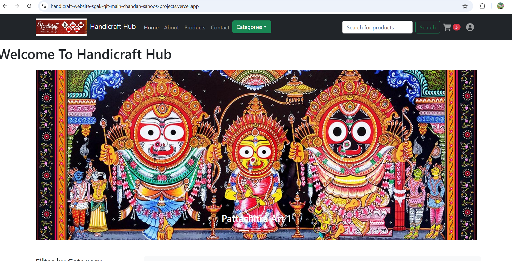
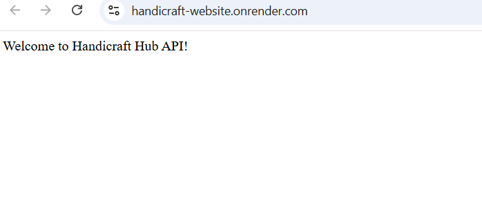

🌿 Handicraft Hub – MERN E-Commerce Website
===========================================

A full-stack MERN application for showcasing and managing handcrafted products.

Built using modern web technologies to provide a seamless shopping experience.

---

## 🚀 Live Demo

🌐 Frontend:
https://handicraft-website-sgak-git-main-chandan-sahoos-projects.vercel.app/

🔧 Backend API:
https://handicraft-website.onrender.com/

---

## 📸 Screenshots

### 🏠 Frontend Website View



---

### 🔧 Backend API Response



---

## 📌 Features

✅ Product Listing  
✅ Category Management  
✅ Image Upload & Display  
✅ Contact Form API  
✅ RESTful API Integration  
✅ Cloud Database (MongoDB Atlas)  
✅ Full CRUD Operations  

---

## 🏗 Tech Stack

### Frontend
- React  
- Axios  
- React Router  
- CSS  

### Backend
- Node.js  
- Express.js  
- MongoDB (Mongoose)  
- CORS  
- dotenv  

### Database
- MongoDB Atlas (Cloud)

---

## 📁 Project Structure


HANDICRAFT-WEBSITE/
├── public/
├── screenshots/
│ ├── frontend.png
│ └── backend.png
├── server/
│ ├── routes/
│ ├── models/
│ ├── uploads/
│ └── index.js
├── src/
├── .gitignore
├── package.json
└── README.md


---

## ⚙️ Installation (Local Setup)

### Clone Repository

```bash
git clone https://github.com/chandugithubui/handicraft-website.git
cd handicraft-website
Backend Setup
cd server
npm install

Create .env file inside server folder:

MONGODB_URI=your_mongodb_connection_string
PORT=5000

Run backend:

node index.js

Backend runs at:

http://localhost:5000
Frontend Setup
cd client
npm install
npm start

Frontend runs at:

http://localhost:3000
🔌 API Endpoints
Method	Endpoint	Description
GET	/api/products	Get all products
POST	/api/products	Add product
GET	/api/categories	Get categories
POST	/api/contacts	Submit contact form
🌍 Deployment

Frontend → Vercel

Backend → Render

Database → MongoDB Atlas

🔐 Environment Variables

Create .env file in server folder:

MONGODB_URI=your_atlas_connection_string
PORT=5000

⚠️ Never commit .env to GitHub.

👨‍💻 Author

Chandan Sahoo

GitHub: https://github.com/chandugithubui

📜 License

This project is for learning and portfolio purposes.